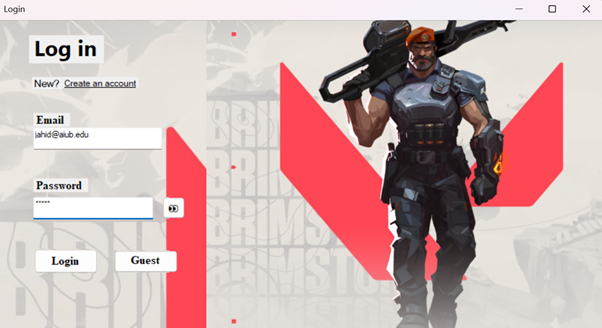
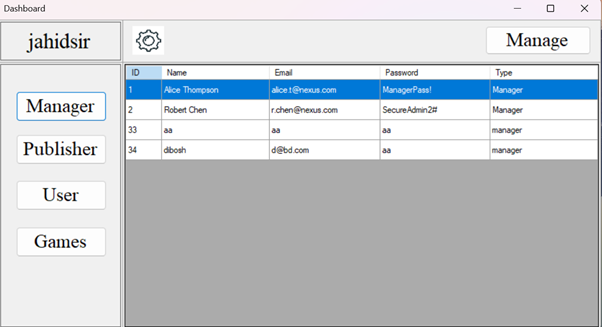
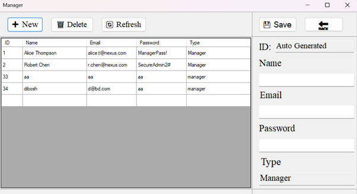
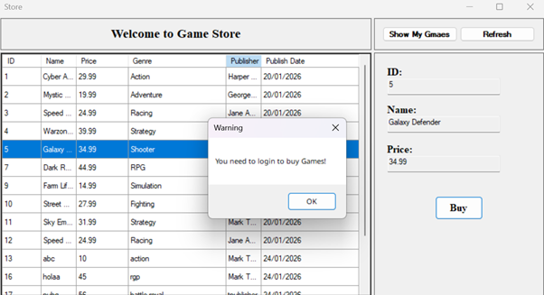
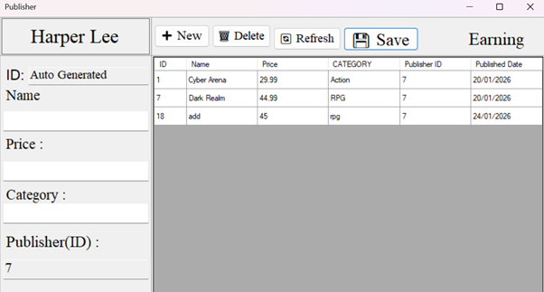
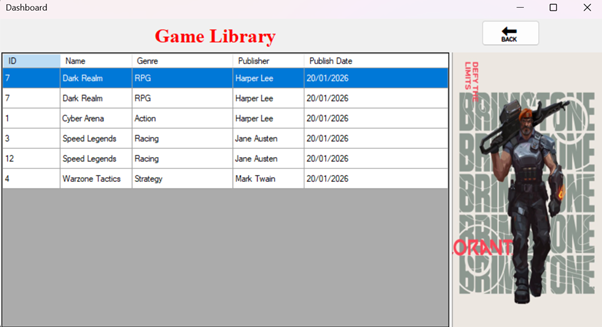
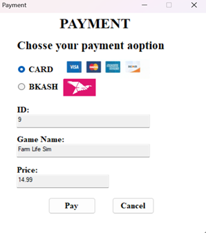

# Online Game Store Management System 🎮

The **Online Game Store Management System (OGSMS)** is a comprehensive C# Windows Forms application designed to streamline the operations of a digital game marketplace. It features a robust role-based access control system, allowing Admins, Managers, Publishers, Users, and Guests to interact with the platform through specialized interfaces. From catalog management to secure transactions, OGSMS provides an all-in-one solution for game store operations.

## ✨ Key Features
- **Role-Based Access Control**: Dedicated dashboards and permissions for Admin, Manager, Publisher, User, and Guest roles.
- **User Authentication**: Secure registration and login system with specific role assignments.
- **Game Marketplace**: An integrated store for users to browse, search, and purchase games across various categories.
- **User Library**: A personalized dashboard for users to view and manage their collection of owned games.
- **Publisher Portal**: Exclusive tools for game publishers to add, update, and manage their game listings.
- **Administrative Dashboard**: Comprehensive management tools for Admins and Managers to oversee user accounts, publisher data, and store inventory.
- **Secure Payments**: Integrated payment processing supporting both **Bkash** and **Card** payment methods.
- **Guest Access**: Allows potential customers to explore the game store and catalog without requiring an initial account.

## 🖼️ Screenshots
| Signup | Login | Admin Dashboard | Manager Dashboard |
| :---: | :---: | :---: | :---: |
|  |  |  |  |
| **Guest Dashboard** | **User Dashboard** | **Game Library** | **Game Store** |
|  |  |  |  |

## 📜 Credits & License
This project was developed as part of the **OOP2 C# Project**.
