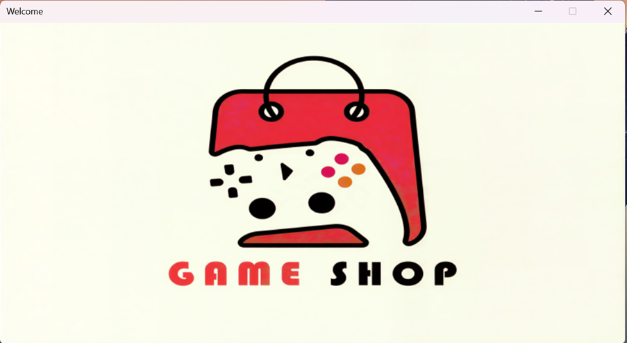
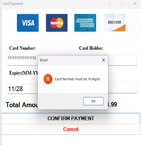
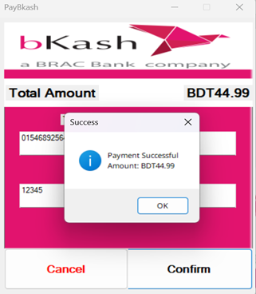
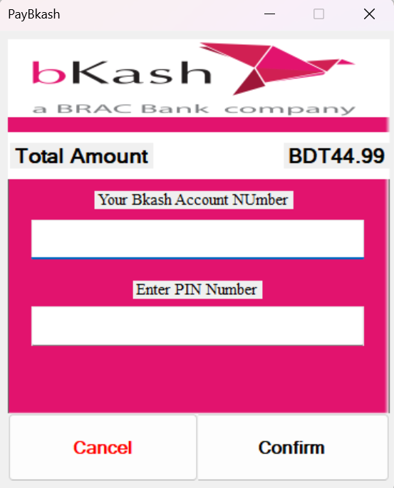

# Online Game Store Management System 🎮

The **Online Game Store Management System (OGSMS)** is a comprehensive C# Windows Forms application designed to streamline the operations of a digital game marketplace. It features a robust role-based access control system, allowing Admins, Managers, Publishers, Users, and Guests to interact with the platform through specialized interfaces. From catalog management to secure transactions, OGSMS provides an all-in-one solution for game store operations.

## ✨ Key Features
- **Role-Based Access Control**: Dedicated dashboards and permissions for Admin, Manager, Publisher, User, and Guest roles.
- **User Authentication**: Secure registration and login system with specific role assignments.
- **Game Marketplace**: An integrated store for users to browse, search, and purchase games across various categories.
- **User Library**: A personalized dashboard for users to view and manage their collection of owned games.
- **Publisher Portal**: Exclusive tools for game publishers to add, update, and manage their game listings.
- **Administrative Dashboard**: Comprehensive management tools for Admins and Managers to oversee user accounts, publisher data, and store inventory.
- **Secure Payments**: Integrated payment processing supporting both **Bkash** and **Card** payment methods.
- **Guest Access**: Allows potential customers to explore the game store and catalog without requiring an initial account.

## 🖼️ Screenshots

### 🖥️ Main Interfaces (Wide View)

   
  <i>1. Welcome Screen</i>  
  
    
  <i>2. Login & 3. Signup</i>  

    
  <i>4. Admin Dashboard & 5. Manager Dashboard</i>  

    
  <i>6. Guest Dashboard & 7. User Dashboard</i>  

   
  <i>8. Game Library</i>

### 🎮 Game Store & Catalog (Vertical Scale)

   
   
   
   
  <i>9, 10, 11, 12. Game Store & Purchasing Views</i>

## 📜 Credits & License
This project was developed as part of the **OOP2 C# Project**.
